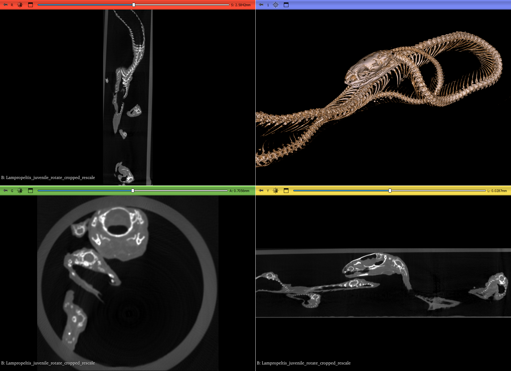

## MorphoDepot Repository
Repository for segmentation of a specimen scan.  See [this JSON file](MorphoDepotAccession.json) for specimen details.
* Species: Lampropeltis californiae
* Modality: Micro CT (or synchrotron)
* Contrast: No
* Dimensions: (438, 1552, 424)
* Spacing (mm): (0.03599999845, 0.03599999845, 0.03599999845)

## Screenshots

_California kingsnake_
